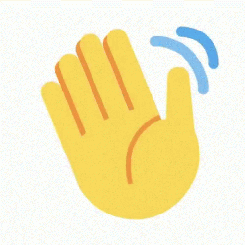

<h1> 𝙷𝚎𝚕𝚕𝚘 <i>𝙳𝚎𝚟𝚎𝚕𝚘𝚙𝚎𝚛𝚜!</i> </h1>
<h1>I'm <i>Santhosh Sivan A</i> </h1>
<h3>I'm a <i><b>Passionate Learner,</b></i> Learning <i><b>Full-stack Web Development</b></i>  I'm an <i><b>IT Aspirant</b></i> and a <i><b>Frontend Web Development Enthusiast</b></i> </h3>

<h2>About</h2>

I'm a <b>B.Sc Computer Science</b> Graduate, passed out in July 2021. Studied in A.M.Jain College of Arts and Science, Chennai.   

<ul>
  <li>Currently Learning <b><em>Full-stack Web Development</em></b></li>  
</ul>

<h2>Languages and IDE</h2>

